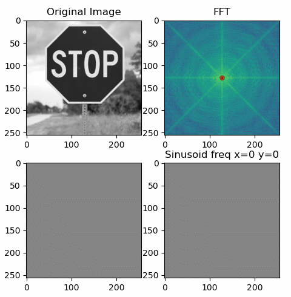
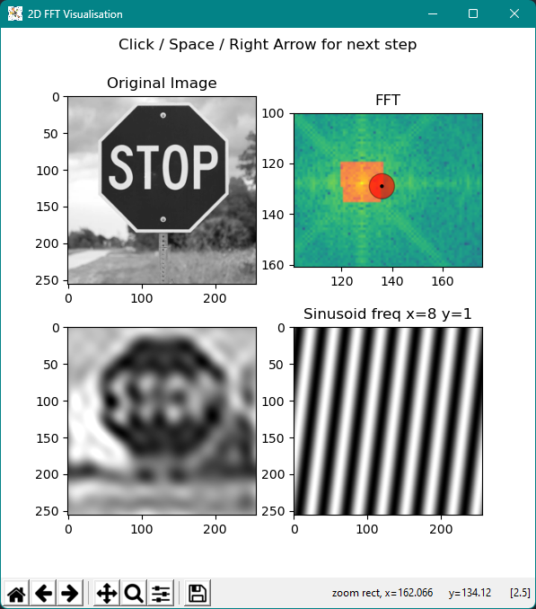
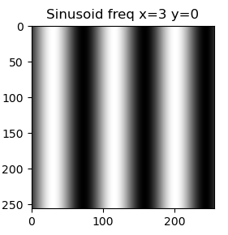
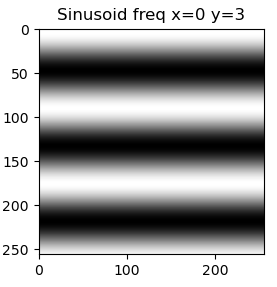
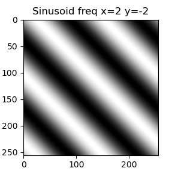

# 2D DFT Visualisation

This project visualises how a two-dimensional discrete Fourier transform works on images. It shows how an image can be decomposed and reconstructed using superposition of two-dimensional sinusoids and how these sinusoids relate to the resulting frequency spectrum.

This project can help improve your intuition on the way a two-dimensional FFT works, illustrate what a 2D FFT even means, and how you can interpret the amplitude spectrum.

# Getting Started

This app was written in Python using `numpy` for computation, `Pillow` for reading images and `matplotlib` for visualisation. Although it uses Python 3.8, other versions will likely also work, however this was not tested.

To get started, get the aforementioned dependencies and copy the `app.py` file to your computer. At the top of the `app.py` file there are multiple constants that you can change in order to customise the visualisation.

To select the input image, edit the `INPUT_IMAGE_PATH` variable. The target image should ideally be square, otherwise it will be distorted when resizing to the desired resolution (`IMAGE_SIZE`).

After setting the input path you can simply execute the app. By clicking anywhere on the screen, pressing the space key or the right arrow key it advances to the next step, adding another sinusoid to the image.

For larger images it can be helpful to zoom into a smaller area of the FFT spectrum using the `Zoom to rectangle` tool in the toolbar in the bottom of the app.

# Explanation

For the one-dimensional case a signal can be represented as a sum of sine waves of different frequencies, amplitudes and phases.

The same underlying idea is also true for a two-dimensional Fourier transform: It represents the 2D signal, i.e. the image, as a sum of 2D sinusoids. These too have amplitude, frequency and phase. However, unlike a simple sine wave, the 2D sinusoids have 2 frequency components: one in the x-direction and one in the y-direction. A combination of these two essentially results in a rotation of the sinusoid, therefore allowing for diagonal "waves".

|  |  |  |
| --------------------------------- | ------------------------------- | ------------------------------- |

By overlapping many 2D sinusoids, as visualised in the app, you finally receive the original image. To know which amplitude and phase is required for each sinusoidal component, you can compute the FFT of the image. The resulting amplitude spectrum is shown in the top right corner of the app. Although phase information is essential, this app chooses to only show the amplitude spectrum to help build an intuitive foundation.

